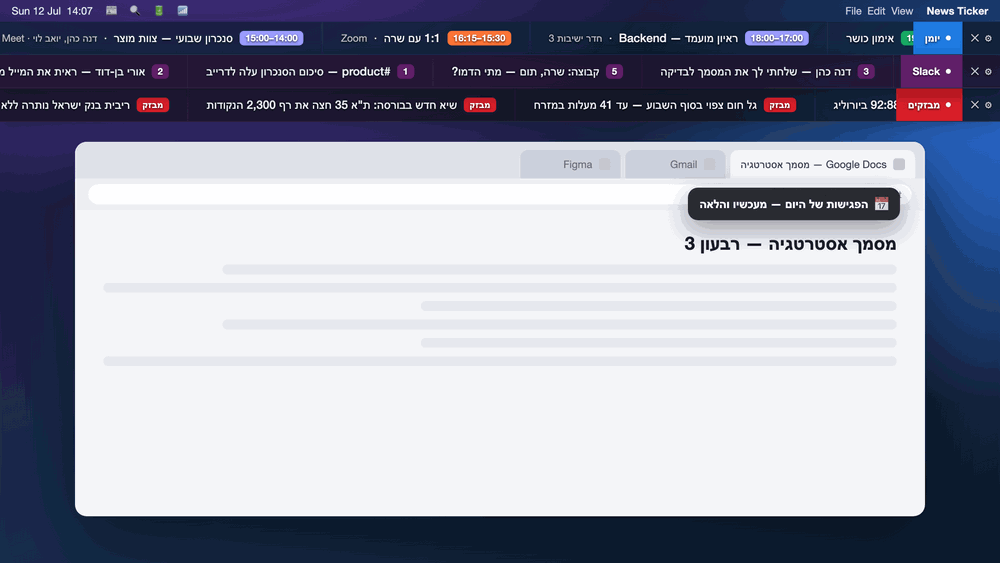

# News Ticker — פס מבזקים ויומן למק

A lightweight macOS **ticker** that lives as thin, translucent bars at the top of the screen.
Each bar is a **lane** fed by its own provider:

- **News lane** — live headlines from Israeli news sites (RSS), merged chronologically.
- **Calendar lane** — today's Google Calendar meetings, from the current time onward.
- **Notes/mantras lane** — your own short texts, typed in Settings (with export/import).
- **Tasks lane** — today's tasks from [the-mic](https://github.com/Zeev-L/the-mic) (מיק), due today or overdue; **right-click a task → mark done** (updates מיק, drops off instantly) or open the board.
- **Slack lane** — unread DMs (and optionally channels), via a Slack user token.

Built with Electron. Lanes are independent: each has its own colours, hotkey, drag position,
and show/hide. Add more by dropping a provider in `providers/`.

> פסים דקים ושקופים בקצה המסך: שורת מבזקים (RSS) ושורת יומן (Google Calendar), כל אחת נשלטת בנפרד.



<sub>Illustrative mockup. Calendar events shown are examples.</sub>

---

## Features

- **Live RSS** from multiple Israeli sources, merged into one stream and sorted newest-first.
- **Two styles** — a continuous running ticker (`scroll`) or one headline at a time (`fade`).
- **Click-through** — the bar ignores the mouse over empty areas, so clicks pass to whatever
  is behind it (e.g. Chrome tabs). Only a headline itself is clickable → opens the article.
- **Draggable** — grab the red "מבזקים" handle to move the bar; the position is remembered.
- **Always on top**, spans the full screen width, semi-transparent (adjustable).
- **Hide / show instantly** — global hotkey `⌘⌥N`, the 📰 menu-bar icon, or the ✕ button.
- **Menu-bar app** — no Dock icon; controlled entirely from the 📰 tray icon.
- **Launch at login** (optional toggle).
- **Settings panel** — sources, position (top/bottom), style, speed, height, font size,
  opacity, refresh interval, hotkey.

## Sources (default)

Each source is any valid RSS feed. Enabled out of the box:

| Source | Feed |
|--------|------|
| ynet מבזקים | `https://www.ynet.co.il/Integration/StoryRss1854.xml` |
| וואלה | `https://rss.walla.co.il/feed/1` |
| ישראל היום | `https://www.israelhayom.co.il/rss.xml` |
| הארץ | `https://www.haaretz.co.il/srv/htz---all-articles` |
| גלובס | `https://www.globes.co.il/webservice/rss/rssfeeder.asmx/FeederNode?iID=2` |
| N12 | `https://rcs.mako.co.il/rss/news-israel.xml` |

Add or remove any feed from the ⚙ Settings panel. Toggle a source off without deleting it.

**Notes:** N12's feed updates slowly and its items link to the mako homepage rather than the
article. Some Haaretz articles are behind a paywall.

## Calendar lane (Google Calendar)

Shows today's timed events across **all** your calendars (work, personal, family…), only from
`now` onward, sorted by start time. Each item:
`[start–end]  event title  ·  first 2 attendees  ·  location` — missing fields are omitted, and
each event's time badge is **coloured by its source calendar**. Click → opens the meeting link
(Meet/Zoom/Teams).

In ⚙ Settings (organized into **tabs** — one per lane + General) the Calendar tab lists all your
Google calendars, each with an **enable toggle** and a **colour picker**.

**One-time setup:** create a Google Cloud OAuth **Desktop app** client (enable Google Calendar
API, configure the OAuth consent screen as *External* and publish it *In production* to avoid
weekly token expiry). Paste the Client ID + Client Secret into the Calendar tab in ⚙ Settings
and click **Connect Google Calendar**. Tokens are stored only in the local settings file.

## Run (development)

```bash
npm install
npm start
```

## Build a standalone `.app`

```bash
npm install --save-dev @electron/packager   # once
npm run build          # see package.json; or run electron-packager directly
```

The build lands in `build/News Ticker-darwin-x64/News Ticker.app`. Copy it to
`/Applications`, then set `LSUIElement=true` in its `Info.plist` to run it as a background
(menu-bar-only) app.

## Project structure

| File | Role |
|------|------|
| `main.js` | Electron main process — one window per lane, tray, hotkeys, drag, IPC, login item, Google OAuth |
| `settings.js` | Lanes config + JSON store (userData); migrates the old single-bar schema |
| `providers/rss.js` | RSS lane provider (wraps `feeds.js`) |
| `providers/calendar.js` | Google Calendar lane provider + one-time OAuth loopback flow |
| `feeds.js` | Fetches + parses RSS feeds (in the main process, so no CORS) |
| `renderer/ticker.html` | The bar UI engine (scroll + fade, click-through, drag, per-lane colours/badge) |
| `renderer/settings.html` | The ⚙ settings panel (per-lane cards + Google connect) |
| `preload.js` | Safe IPC bridge between renderer and main |

Each lane returns normalized items `{ title, meta: [], badge, ts, action }`, so adding a new
data source is just a new provider.

## More lanes

Every lane is just a small provider returning `{ title, meta, badge, ts, action }`, so sources
are easy to add.

- **Slack** ✅ — unread DMs (and optionally channels) via the Slack Web API with a **user
  token**. Enable the Slack lane in ⚙ Settings, paste a Slack User OAuth Token (`xoxp-…`), and
  it shows your unread conversations, newest first, click → opens Slack. (Scopes on the token:
  `channels:read groups:read im:read mpim:read channels:history groups:history im:history
  mpim:history users:read`.)
- **Google Chat** — technically possible via the Chat API, but Google serves it **only for
  Google Workspace accounts**; the API does not work for personal `@gmail.com`. Not included.
- Anything else — add a file under `providers/` and a lane entry in `settings.js`.

Settings are stored at
`~/Library/Application Support/news-ticker/settings.json` — not in the repo.

## License

MIT
